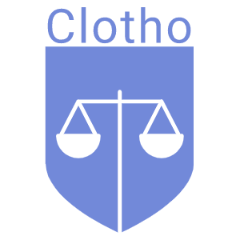

<!--
*** Thanks for checking out the Best-README-Template. If you have a suggestion
*** that would make this better, please fork the repo and create a pull request
*** or simply open an issue with the tag "enhancement".
*** Thanks again! Now go create something AMAZING! :D
***
***
***
*** To avoid retyping too much info. Do a search and replace for the following:
*** github_username, repo_name, twitter_handle, email, project_title, project_description
-->


<!-- PROJECT SHIELDS -->
<!--
*** I'm using markdown "reference style" links for readability.
*** Reference links are enclosed in brackets [ ] instead of parentheses ( ).
*** See the bottom of this document for the declaration of the reference variables
*** for contributors-url, forks-url, etc. This is an optional, concise syntax you may use.
*** https://www.markdownguide.org/basic-syntax/#reference-style-links
-->
[![Contributors][contributors-shield]][contributors-url]
[![Forks][forks-shield]][forks-url]
[![Stargazers][stars-shield]][stars-url]
[![Issues][issues-shield]][issues-url]
[![MIT License][license-shield]][license-url]


<!-- PROJECT LOGO -->
<br />
<p align="center">
  <a href="https://github.com/ShowMeTheRoapes/clotho">
    
  </a>

  <h3 align="center">Clotho</h3>

  <p align="center">
    A Discord bot to aid in group-based decision-making
    <br />
    <a href="https://github.com/ShowMeTheRoapes/clotho/issues/new/choose">Report Bug</a>
    ·
    <a href="https://github.com/ShowMeTheRoapes/clotho/issues/new/choose">Request Feature</a>
  </p>
</p>


<!-- TABLE OF CONTENTS -->
<details open="open">
  <summary>Table of Contents</summary>
  <ol>
    <li>
      <a href="#about-the-project">About The Project</a>
      <ul>
        <li><a href="#built-with">Built With</a></li>
      </ul>
    </li>
    <li>
      <a href="#getting-started">Getting Started</a>
      <ul>
        <li><a href="#prerequisites">Prerequisites</a></li>
        <li><a href="#installation">Installation</a></li>
        <li><a href="#set-up">Set Up</a></li>
      </ul>
    </li>
    <li><a href="#usage">Usage</a></li>
    <li><a href="#roadmap">Roadmap</a></li>
    <li><a href="#faq">FAQ</a></li>
    <li><a href="#contributing">Contributing</a></li>
    <li><a href="#license">License</a></li>
    <li><a href="#author">Author</a></li>
  </ol>
</details>


<!-- ABOUT THE PROJECT -->
## About The Project

[![Clotho Screen Shot][product-screenshot]](https://github.com/ShowMeTheRoapes/clotho)

Clotho is a Discord bot that I made to help my friends and I suggest things, vote on said things, and determine which thing wins via anonymous surveys.
The surveys are supplied using [StrawPoll](https://strawpoll.com/) and their [free API](https://strawpoll.com/api-docs) (thanks StrawPoll!).

### Built With

* [NodeJS](https://nodejs.org/en/)
* [DiscordJS](https://discord.js.org/#/)

I actually followed a pretty [straight-forward tutorial](https://www.digitalocean.com/community/tutorials/how-to-build-a-discord-bot-with-node-js#prerequisites) to get the bot itself set up in Discord. I highly recommend it if you're looking to build your own!


<!-- GETTING STARTED -->
## Getting Started

As of right now, I don't have this bot hosted anywhere for public use. To get a local copy up and running follow these simple steps.

### Prerequisites

You'll need the latest version of [Node](https://nodejs.org/en/), and that's about it.
```sh
npm install npm@latest -g
```

### Installation

1. Clone the repo
   ```sh
   git clone https://github.com/ShowMeTheRoapes/clotho.git
   ```
2. Install NPM packages
   ```sh
   # if you use npm
   npm install

   # if you use yarn
   yarn
   ```

### Set Up
1. [Create a bot account on Discord, generate a token, and invite it to your channel](https://discordpy.readthedocs.io/en/latest/discord.html)
1. Create a [StrawPoll](https://strawpoll.com/) account and generate an API key by going to **Settings** => **API Key**
1. In the root directory of Clotho, create a file called `config.json` that looks like this:
   ```json
   {
     "BOT_TOKEN": "Your bot's token",
     "STRAWPOLL_KEY": "Your StrawPoll API key"
   }
   ```

### Running Clotho
1. Go to the root directory
1. `yarn && yarn start`
1. Your terminal should say "Clotho is up and running!"
   * If you also see that the bot account you put in your channel is active with a green dot next to it, then you're good to go!


<!-- USAGE EXAMPLES -->
## Usage
> "Great, the bot is running. Now how do I use it??"
\- You, probably

All of Clotho's commands begin with `!!`, and you can always get a printed summary of every command with `!!help`. Clotho's status in Discord displays as "Playing !!help", so you can look at the bot's avatar in the server if you forget the help command. :+1:

### Commands
|   Command   | Parameters |                                                                                                                  Explanation                                                                                                                 |
|:-----------:|:----------:|:--------------------------------------------------------------------------------------------------------------------------------------------------------------------------------------------------------------------------------------------:|
| `!!ping`      | None       | Clotho replies with a message to let you know she is up and running.                                                                                                                                                                         |
| `!!help`      | None       | Clotho will reply with a list of all commands and how to use them.                                                                                                                                                                           |
| `!!startpoll` | Poll Title | Clotho will begin recording information for a poll with the given title.<br>Users will now be able to use the `!!submit` command.                                                                                                                |
| `!!submit`    | Candidate  | Clotho will record your candidate and user information for the open poll.<br>If you submit another candidate, it will replace your current one.<br>Clotho will send you a private message to show you what she received/saved as your submission. |
| `!!closepoll` | None       | Clotho will no longer accept submissions for the open poll.<br>Clotho will use the StrawPoll API to create a poll with all of the submitted candidates and post the link to it.                                                                 |
| `!!declare`   | None       | Clotho will inspect the StrawPoll, determine which candidate is the winner, and post a message about it.<br>All poll information will be cleared and a new one may be started.                                                                  |


<!-- ROADMAP -->
## Roadmap
As of right now, there isn't much else that I want to add. I have one or two quality-of-life commands that I would like to add, and I may come up with a better/more efficient way for the bot to perform its utilities, but at the moment it's working perfectly for my friends and I!

See the [open issues](https://github.com/ShowMeTheRoapes/clotho/issues) for a list of proposed features (and known issues).


<!-- FAQ -->
## FAQ
Or rather, what I'm anticipating people will ask

#### Why "Clotho"?
[Clotho](https://en.wikipedia.org/wiki/Clotho) is one of the three Sisters of Fate in Greek mythology. Specifically, she's the one who spins the thread of human life and thus makes all major decisions. It seemed to fit the goal, however dramatic it may be. :)

#### Can't I just use your bot?
At the moment I don't have a publicly hosted version of the bot available, but if there's enough interest I would be willing to put some work towards that!


<!-- CONTRIBUTING -->
## Contributing
Contributions are what make the open source community such an amazing place to be learn, inspire, and create. Any contributions you make are **greatly appreciated**.

1. Fork the Project
2. Create your Feature Branch (`git checkout -b feature/AmazingFeature`)
3. Commit your Changes (`git commit -m 'Add some AmazingFeature'`)
4. Push to the Branch (`git push origin feature/AmazingFeature`)
5. Open a Pull Request


<!-- LICENSE -->
## License
Distributed under the GPL 2.0 License. See `LICENSE` for more information.


<!-- CONTACT -->
## Author
Alex Hoopes: kevin.alex.hoopes@gmail.com


<!-- MARKDOWN LINKS & IMAGES -->
<!-- https://www.markdownguide.org/basic-syntax/#reference-style-links -->
[contributors-shield]: https://img.shields.io/github/contributors/ShowMeTheRoapes/clotho.svg?style=for-the-badge
[contributors-url]: https://github.com/ShowMeTheRoapes/clotho/graphs/contributors
[forks-shield]: https://img.shields.io/github/forks/ShowMeTheRoapes/clotho.svg?style=for-the-badge
[forks-url]: https://github.com/ShowMeTheRoapes/clotho/network/members
[stars-shield]: https://img.shields.io/github/stars/ShowMeTheRoapes/clotho.svg?style=for-the-badge
[stars-url]: https://github.com/ShowMeTheRoapes/clotho/stargazers
[issues-shield]: https://img.shields.io/github/issues/ShowMeTheRoapes/clotho.svg?style=for-the-badge
[issues-url]: https://github.com/ShowMeTheRoapes/clotho/issues
[license-shield]: https://img.shields.io/github/license/ShowMeTheRoapes/clotho.svg?style=for-the-badge
[license-url]: https://github.com/ShowMeTheRoapes/clotho/blob/master/LICENSE.txt
[product-screenshot]: images/clotho-demo.gif
